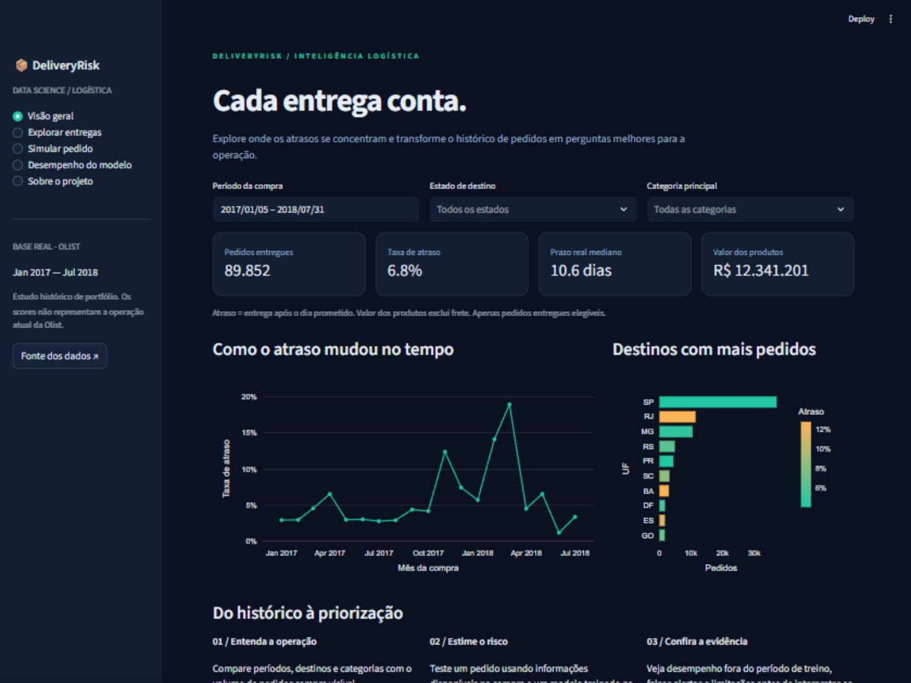
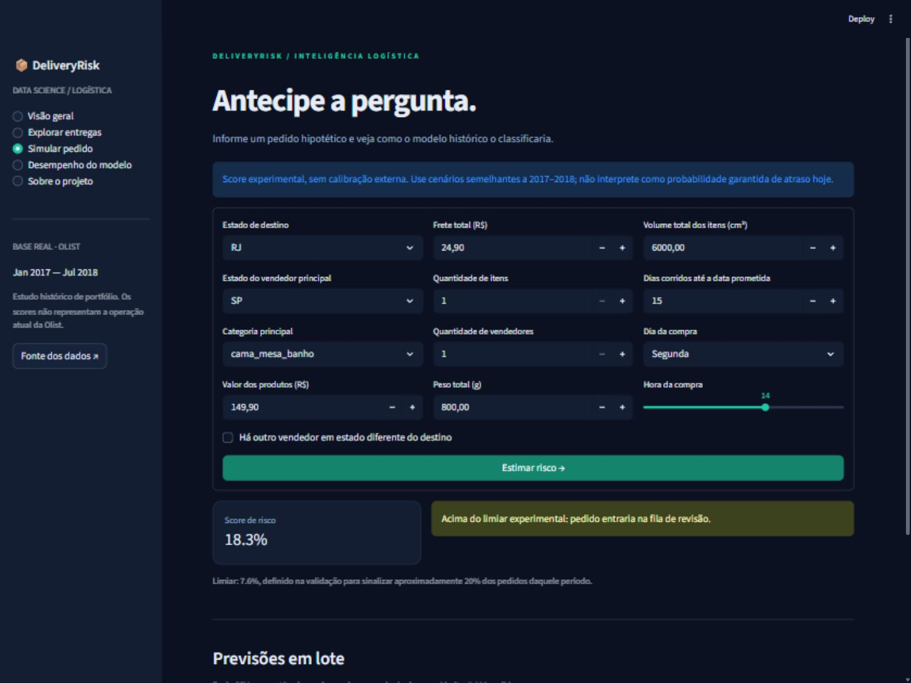

# 📦 DeliveryRisk

**Análise de entregas e previsão de risco de atraso no e-commerce brasileiro.**

Python · SQL · pandas · scikit-learn · Streamlit · Plotly · testes automatizados



Um projeto de ciência de dados de ponta a ponta: dados reais da Olist, preparação
na granularidade de pedido, análise exploratória, comparação de modelos,
avaliação temporal e simulador interativo.

> Estudo histórico de portfólio, com resultados e limitações explícitos.
> Não é um sistema validado para decisões operacionais atuais.

## O que você pode explorar

- **Visão geral:** indicadores, evolução mensal e destinos com mais pedidos.
- **Explorar entregas:** filtros por período/UF/categoria, mínimo de amostra e exportação CSV.
- **Simular pedido:** formulário validado e previsão em lote de até 5.000 pedidos.
- **Desempenho:** comparação na validação, matriz de confusão, curva precision–recall
  e importância por permutação.
- **Reprodução:** download oficial, pipeline de treinamento, consultas SQL e testes.

## Executar em poucos minutos

Requisito: **Python 3.12**. Os artefatos treinados estão incluídos; a demonstração
funciona sem chave de API, sem GPU e sem baixar a base original.

```bash
python -m venv .venv
```

Ative no Windows (PowerShell):

```powershell
.venv\Scripts\Activate.ps1
```

Ou no macOS/Linux:

```bash
source .venv/bin/activate
```

Depois:

```bash
python -m pip install -r requirements.txt
python -m streamlit run app.py
```

Abra o endereço local mostrado no terminal, normalmente http://localhost:8501.
Se a ativação no Windows estiver bloqueada, use diretamente
`.venv\Scripts\python.exe -m pip install -r requirements.txt` e
`.venv\Scripts\python.exe -m streamlit run app.py` — não precisa alterar a política do sistema.

<details>
<summary>Ver o simulador</summary>



</details>

## Resultados reais desta versão

Dos **99.441 pedidos de origem**, **89.852** passaram pelos critérios do estudo.
A taxa de atraso no recorte completo foi **6,83%**. O teste final contém **19.001 pedidos**.

| Métrica no teste | Resultado |
|---|---:|
| Modelo selecionado na validação | Gradient boosting |
| Average precision | 0.0750 |
| Average precision — baseline constante | 0.0380 |
| ROC AUC | 0.6756 |
| Recall dos atrasos | 45.98% |
| Precisão dos alertas | 7.18% |
| Pedidos sinalizados | 24.34% |
| Brier score — modelo / baseline | 0.03677 / 0.03672 |

**Leitura honesta:** o modelo melhora a ordenação dos pedidos sobre a baseline,
mas apenas cerca de 7 em cada 100 alertas correspondem a atrasos. O Brier score
não melhora sobre a baseline; os scores precisam de estudo de calibração antes de
serem tratados como probabilidades operacionais. O limiar veio da validação e não
foi ajustado para melhorar os resultados de teste.

O experimento encontrou **332 atrasos**, deixou **390** sem alerta e gerou **4.293
falsos alertas**. Isso permite discutir custo de intervenção, drift e limites do
modelo, sem inventar economia financeira.

Detalhes: [relatório de resultados](reports/RESULTS.md),
[metodologia](docs/METHODOLOGY.md), [model card](docs/MODEL_CARD.md)
e [métricas auditáveis](artifacts/metrics.json).

## Como evitamos vazamento de dados

1. Features limitadas a informações do pedido disponíveis na compra.
2. Datas reais de entrega e avaliações não entram no modelo.
3. Imputação, escala e codificação são ajustadas somente no treino.
4. Separação temporal e exigência de rótulos já observados no corte.
5. Escolha do modelo e limiar na validação; teste reservado para avaliação final.

| Conjunto | Período de compra | Pedidos usados |
|---|---|---:|
| Treino | Jan/2017–Fev/2018 | 53,377 |
| Validação | Mar–Abr/2018 | 11,040 |
| Teste | Mai–Jul/2018 | 19,001 |

Os conjuntos não somam o total do painel: pedidos com entrega ainda desconhecida
na data de corte são removidos do treino/validação. Essa escolha também introduz
viés para entregas observáveis, descrito na metodologia.

## Reproduzir o treinamento

```bash
python -m scripts.download_data
python -m deliveryrisk.train --raw data/raw --output artifacts
python -m scripts.sql_report
python -m scripts.predict_batch examples/orders.csv reports/example_predictions.csv
```

Se o endpoint do Kaggle estiver indisponível, baixe a
[base oficial](https://www.kaggle.com/datasets/olistbr/brazilian-ecommerce)
e extraia os CSVs em `data/raw/`. O treino usa cinco tabelas:
orders, order_items, customers, products e sellers. A execução não exige GPU.
O seed é 42; hashes dos dados e versões estão em `artifacts/metrics.json`.

Carregue apenas arquivos `joblib` de origem confiável: esse formato pode executar
código. O aplicativo aceita upload apenas de CSV, não de modelos.

## Testes

```bash
python -m pip install -r requirements-dev.txt
python -m pytest -q
```

Cobertura funcional: agregação por pedido, prazo por dia de calendário, indicador
interestadual, purga temporal, bloqueio de atributos futuros, entradas inválidas,
categorias desconhecidas, métricas publicadas, páginas do aplicativo e simulador.
**Validação local: 19 testes aprovados.** O GitHub Actions executa os testes a cada push/PR.
Confira [a verificação da entrega](reports/VALIDATION.md). Para replicar as versões
transitivas do ambiente testado, use `requirements-lock.txt` em Python 3.12.

## Estrutura

```text
app.py                  Interface Streamlit
 deliveryrisk/          Dados, treino, avaliação e inferência
 scripts/               Download, SQL e previsão em lote
 sql/                   Consultas analíticas reproduzíveis
 artifacts/             Modelo, métricas e extrato sem identificadores
 examples/              Pedidos para testar inferência
 tests/                 Testes do pipeline e da interface
 reports/               Resultados e exportações SQL
 docs/                  Metodologia, imagens e guia de publicação
 .github/workflows/     Integração contínua
```


## Limitações e evolução

A base é antiga e inclui apenas pedidos entregues. O modelo não foi testado em
produção, não inclui clima/transportadora e não mede impacto financeiro. As taxas
de atraso mudam entre treino, validação e teste. Próximos passos: backtesting em
múltiplas janelas, avaliação por grupo, calibração independente e dados recentes
com autorização de uso. Dockerfile incluído, mas imagem Docker não validada nesta entrega.

## Dados e licenças

Créditos: **Olist e colaboradores — Brazilian E-Commerce Public Dataset by Olist**.
Código autoral: [MIT](LICENSE). Dados e derivados: **CC BY-NC-SA 4.0**,
com atribuição, uso não comercial e compartilhamento pela mesma licença.
Veja [DATA_LICENSE.md](DATA_LICENSE.md). Sem afiliação ou endosso da Olist.
